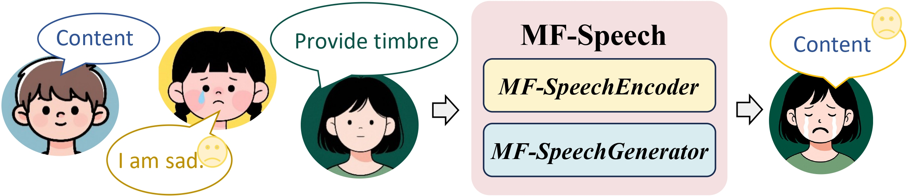

# MF-Speech: Achieving Fine-Grained and Compositional Control in Speech Generation via Factor Disentanglement

<!--  -->


## 📢 News

🎉 **Accepted to AAAI 2026 as Oral Presentation!** 

## Overview

MF-Speech is a novel framework that achieves **fine-grained and compositional control** in speech generation by disentangling content, timbre, and emotion factors. This approach overcomes fundamental challenges in expressive speech synthesis through multi-objective optimization and hierarchical adaptive normalization.


## Key Contributions

- **Factor Disentanglement**: MF-SpeechEncoder decomposes speech into highly pure and independent representations of content, timbre, and emotion
- **Compositional Control**: MF-SpeechGenerator enables precise, composable, and fine-grained control through Dynamic Fusion Module and Hierarchical Style Adaptive Normalization (HSAN)
- **Superior Performance**: Achieves state-of-the-art results with:
  - Lower **Word Error Rate (WER = 4.67%)**
  - Superior **Style Control (SECS = 0.5685, Corr = 0.68)**
  - Highest **Subjective Evaluation Scores (nMOS = 3.96, sMOS_emotion = 3.86, sMOS_style = 3.78)**
  - **Strong Transferability** as a general-purpose speech representation


## Architecture

The MF-Speech framework consists of two core components:

### MF-SpeechEncoder
Acts as a **factor purifier** that:
- Adopts multi-objective optimization strategy
- Decomposes speech signals into pure, independent representations
- Extracts content, timbre, and emotion factors

### MF-SpeechGenerator
Functions as a **conductor** that:
- Dynamically fuses different factors
- Applies Hierarchical Style Adaptive Normalization (HSAN)
- Enables fine-grained control over generated speech characteristics

## Demo & Evaluation

This repository includes interactive demonstrations comparing MF-Speech with state-of-the-art baselines:

### 1. Speech Reconstruction
Demonstrates the model's ability to reconstruct speech with accurate factor disentanglement

### 2. Multi-Factor Compositional Speech Generation
Shows compositional control by combining content, timbre, and emotion from different sources

**Baseline Methods**:
- StyleVC
- DDDMVC
- NS2VC
- FAcodeC

<!-- ## Project Structure

```
├── index.html                 # Interactive demo page
├── static/
│   ├── audios/
│   │   ├── mix/              # Compositional generation samples
│   │   └── recon/            # Reconstruction samples
│   ├── css/                  # Stylesheets
│   │   └── index.css         # Custom styling
│   ├── images/               # Framework diagrams
│   ├── js/                   # Interactive scripts
│   └── pdfs/                 # Paper PDF
└── README.md                 # This file
``` -->

<!-- ## Citation

If you find MF-Speech useful in your research, please cite:

```bibtex
@article{yu2025mfspeech,
  title={MF-Speech: Achieving Fine-Grained and Compositional Control in Speech Generation via Factor Disentanglement},
  author={Yu, Xinyue and Fang, Youqing and Wu, Pingyu and Ye, Guoyang and Zhou, Wenbo and Zhang, Weiming and Xiao, Song},
  journal={Proceedings of the AAAI Conference on Artificial Intelligence},
  year={2026},
  volume={40},
  pages={TBD}
}
``` -->

## Authors

- **Xinyue Yu**
- **Youqing Fang**
- **Pingyu Wu**
- **Guoyang Ye**
- **Wenbo Zhou**
- **Weiming Zhang**
- **Song Xiao**

**Affiliation**: School of Cyber Science and Technology, University of Science and Technology of China (USTC)

## Links

- 📄 [Paper PDF](static/pdfs/MF_Speech.pdf)
- 💻 [Code Repository](https://github.com/guoyang25/mf-speech)
- 🌐 [Project Page](https://guoyang25.github.io/mf-speech/)

## Conference Information

**AAAI 2026** - The 40th AAAI Conference on Artificial Intelligence
- **Decision**: Oral Presentation
- **Decision Date**: November 8, 2025
- **Presentation Type**: Oral

## License

This project is licensed under the MIT License - see the LICENSE file for details.

## Acknowledgments

We thank:
- The AAAI 2026 Program Chairs, Area Chairs, and Reviewers for their valuable feedback
- All colleagues who contributed to this research
- The open-source community for supporting tools and frameworks

<!-- ---

For questions or inquiries, please contact the corresponding author or visit our research group page at USTC.

**Last Updated**: November 2025 -->